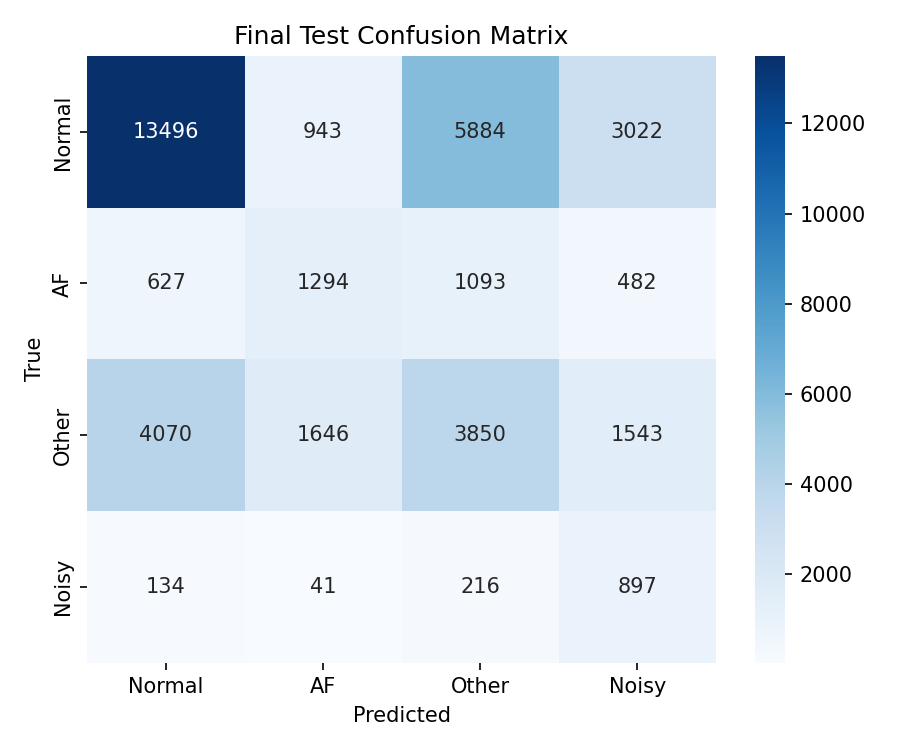
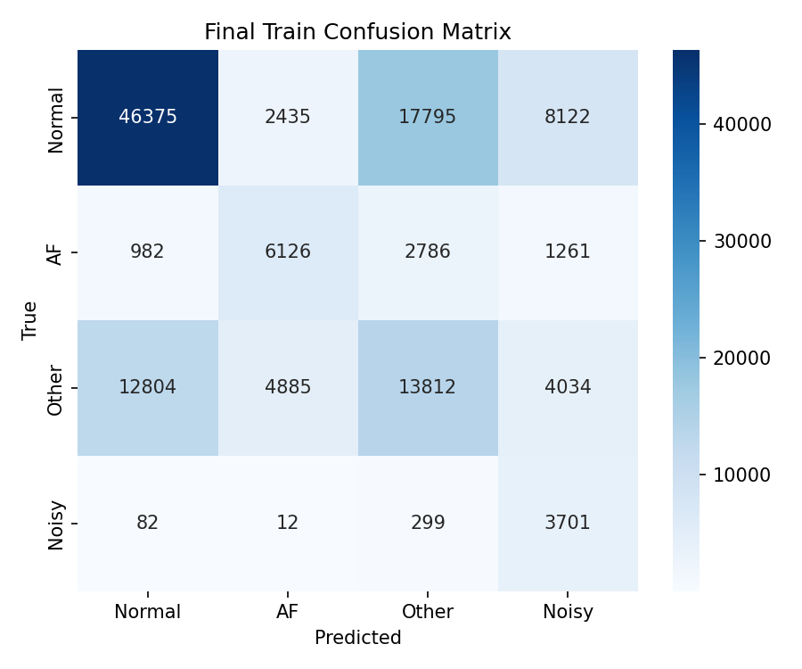
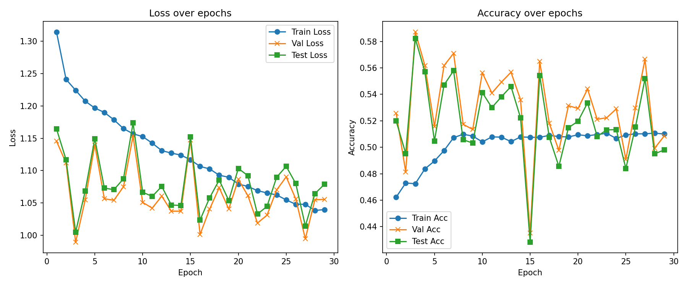
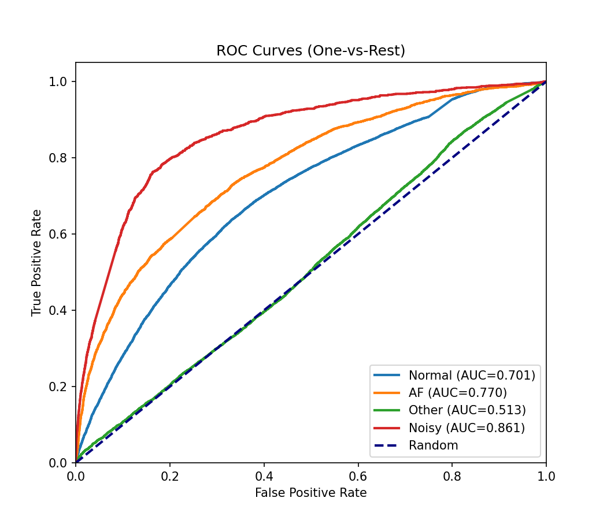

<div align="center">


[](https://linkedin.com/in/bunyaminergen)

</div>

# Heartbeat

`Heartbeat` is a research project focused on classifying heartbeats using ECG (electrocardiogram) data. Within the scope
of this project, both conventional and state-of-the-art models from the literature, as well as experimental deep
learning architectures, will be investigated and compared through experimental analyses.

**Note**: _This is only a `v0.1.0 Initial` version; many new features will be added, models
will be fine-tuned or trained from scratch, and various optimization efforts will be applied. For more information,
you can check out the [Upcoming](#upcoming) section._

**Note**: _If you would like to contribute to this repository,
please read the [CONTRIBUTING](.docs/documentation/CONTRIBUTING.md) first._

---

### Table of Contents

- [Prerequisites](#prerequisites)
- [Features](#features)
- [Reports](#reports)
- [Installation](#installation)
- [File Structure](#file-structure)
- [Version Control System](#version-control-system)
- [Upcoming](#upcoming)
- [Documentations](#documentations)
- [License](#licence)
- [Links](#links)
- [Team](#team)
- [Contact](#contact)
- [Citation](#citation)

---

### Prerequisites

- `Python 3.12` _(or above)_
- `aws cli` _(for dataset download)_

---

### Features

##### Models

- [x] OneDCNN
- [x] AdvancedOneDCNN
- [x] OneDSelfONN
- [x] AdvancedOneDSelfONN

---

### Reports

##### Metrics

##### OneDSelfONN







##### Benchmark

| Model               | Accuracy | Precision | Recall | F1 Score |
|---------------------|----------|-----------|--------|----------|
| OneDCNN             | 0.59     | 0.36      | 0.59   | 0.45     |
| AdvancedOneDCNN     | 0.59     | 0.35      | 0.59   | 0.44     |
| OneDSelfONN         | 0.60     | 0.44      | 0.58   | 0.45     |
| AdvancedOneDSelfONN | 0.58     | 0.58      | 0.56   | 0.43     |


---

### Installation

##### Linux/Ubuntu

```bash
sudo apt update -y && sudo apt upgrade -y
```

```bash
git clone https://github.com/bunyaminergen/Heartbeat
```

```bash
cd Heartbeat
```

```bash
conda env create -f environment.yaml
```

```bash
conda activate Heartbeat
```

##### Dataset Download

```bash
aws s3 sync --no-sign-request s3://physionet-open/challenge-2017/1.0.0/training .data/raw/train
```

```bash
aws s3 sync --no-sign-request s3://physionet-open/challenge-2017/1.0.0/validation .data/raw/validation
```

---

### File Structure

```Text
.
├── config
│        └── config.yaml
├── .data
│         ├── binary
│         │         ├── labels.npy
│         │         └── signals.npy
│         └── raw
│             ├── train
│             │         ├── A00
│             │         │   ├── A00001.hea
│             │         │   ├── A00001.mat
│             │         │   ├── A00002.hea
│             │         │   ├── A00002.mat
│             │         │   ├── ...
│             │         │   ├── A00998.hea
│             │         │   ├── A00998.mat
│             │         │   ├── A00999.hea
│             │         │   └── A00999.mat
│             │         ├── A01
│             │         │   ├── A01000.hea
│             │         │   ├── A01000.mat
│             │         │   ├── A01001.hea
│             │         │   ├── A01001.mat
│             │         │   ├── ...
│             │         │   ├── A01998.hea
│             │         │   ├── A01998.mat
│             │         │   ├── A01999.hea
│             │         │   └── A01999.mat
│             │         ├── A02
│             │         │   ├── A02000.hea
│             │         │   ├── A02000.mat
│             │         │   ├── A02001.hea
│             │         │   ├── A02001.mat
│             │         │   ├── ...
│             │         │   ├── A02998.hea
│             │         │   ├── A02998.mat
│             │         │   ├── A02999.hea
│             │         │   └── A02999.mat
│             │         ├── A03
│             │         │   ├── A03000.hea
│             │         │   ├── A03000.mat
│             │         │   ├── A03001.hea
│             │         │   ├── A03001.mat
│             │         │   ├── ...
│             │         │   ├── A03998.hea
│             │   │   ├── A03998.mat
│             │   │   ├── A03999.hea
│             │   │   └── A03999.mat
│             │   ├── A04
│             │   │   ├── A04000.hea
│             │   │   ├── A04000.mat
│             │   │   ├── A04001.hea
│             │   │   ├── A04001.mat
│             │   │   ├── ...
│             │   │   ├── A04998.hea
│             │   │   ├── A04998.mat
│             │   │   ├── A04999.hea
│             │   │   └── A04999.mat
│             │   ├── A05
│             │   │   ├── A05000.hea
│             │   │   ├── A05000.mat
│             │   │   ├── A05001.hea
│             │   │   ├── A05001.mat
│             │   │   ├── ...
│             │   │   ├── A05998.hea
│             │   │   ├── A05998.mat
│             │   │   ├── A05999.hea
│             │   │   └── A05999.mat
│             │   ├── A06
│             │   │   ├── A06000.hea
│             │   │   ├── A06000.mat
│             │   │   ├── A06001.hea
│             │   │   ├── A06001.mat
│             │   │   ├── ...
│             │   │   ├── A06998.hea
│             │   │   ├── A06998.mat
│             │   │   ├── A06999.hea
│             │   │   └── A06999.mat
│             │   ├── A07
│             │   │   ├── A07000.hea
│             │   │   ├── A07000.mat
│             │   │   ├── A07001.hea
│             │   │   ├── A07001.mat
│             │   │   ├── ...
│             │   │   ├── A07998.hea
│             │   │   ├── A07998.mat
│             │   │   ├── A07999.hea
│             │   │   └── A07999.mat
│             │   ├── A08
│             │   │   ├── A08000.hea
│             │   │   ├── A08000.mat
│             │   │   ├── A08001.hea
│             │   │   ├── A08001.mat
│             │   │   ├── ...
│             │   │   ├── A08527.hea
│             │   │   ├── A08527.mat
│             │   │   ├── A08528.hea
│             │   │   └── A08528.mat
│             │   ├── MD5SUMS
│             │   ├── RECORDS
│             │   ├── RECORDS-af
│             │   ├── RECORDS-noisy
│             │   ├── RECORDS-normal
│             │   ├── RECORDS-other
│             │   ├── REFERENCE.csv
│             │   ├── REFERENCE-v0.csv
│             │   ├── REFERENCE-v1.csv
│             │   ├── REFERENCE-v2.csv
│             │   ├── REFERENCE-v3.csv
│             │   ├── SHA1SUMS
│             │   └── SHA256SUMS
│             └── validation
│                 ├── A00001.hea
│                 ├── A00001.mat
│                 ├── A00002.hea
│                 ├── A00002.mat
│                 ├── ...
│                 ├── A04735.hea
│                 ├── A04735.mat
│                 ├── A04805.hea
│                 ├── A04805.mat
│                 ├── MD5SUMS
│                 ├── RECORDS
│                 ├── RECORDS-af
│                 ├── RECORDS-noisy
│                 ├── RECORDS-normal
│                 ├── RECORDS-other
│                 ├── REFERENCE.csv
│                 ├── REFERENCE-v0.csv
│                 ├── REFERENCE-v1.csv
│                 ├── REFERENCE-v2.csv
│                 ├── REFERENCE-v3.csv
│                 ├── SHA1SUMS
│                 └── SHA256SUMS
├── .docs
│         ├── documentation
│         │         ├── CONTRIBUTING.md
│         │         └── RESOURCES.md
│         ├── img
│         │         └── HeartbeatLogo.png
│         └── report
│             └── img
│                 ├── confusion_matrix_test.png
│                 ├── confusion_matrix_train.png
│                 ├── confusion_matrix_val.png
│                 ├── roc_curve.png
│                 └── training.png
├── environment.yaml
├── .gitignore
├── LICENSE
├── .logs
│         └── heartbeat.log
├── main.py
├── notebook
│         └── eda.ipynb
├── README.md
├── requirements.txt
├── src
│         ├── model
│         │         ├── evaluation.py
│         │         ├── model.py
│         │         └── train.py
│         └── utils
│             ├── data
│             │         └── manager.py
│             ├── log
│             │         └── manager.py
│             └── visualization
│                 └── visualize.py

29 directories, 17707 files
```

---

### Version Control System

##### Releases

- [v0.1.0](https://github.com/bunyaminergen/Heartbeat/archive/refs/tags/v1.0.0.zip) _.zip_
- [v0.1.0](https://github.com/bunyaminergen/Heartbeat/archive/refs/tags/v1.0.0.tar.gz) _.tar.gz_

##### Branches

- [main](https://github.com/bunyaminergen/Heartbeat/main/)
- [develop](https://github.com/bunyaminergen/Heartbeat/main/)

---

### Upcoming

- [ ] **Speech Emotion Recognition:** Develop a model to automatically detect emotions from speech data.

##### Considerations

- [ ] Transform the code structure into a pipeline for better modularity and scalability.

---

### Documentations

- [RESOURCES](.docs/documentation/RESOURCES.md)
- [CONTRIBUTING](.docs/documentation/CONTRIBUTING.md)

---

### Licence

- [LICENSE](LICENSE)

---

### Links

- [Github](https://github.com/bunyaminergen/Heartbeat)
- [Website](https://bunyaminergen.com)
- [Linkedin](https://www.linkedin.com/in/bunyaminergen)

---

### Team

- [Bunyamin Ergen](https://www.linkedin.com/in/bunyaminergen)

---

### Contact

- [Mail](mailto:info@bunyaminergen.com)

---

### Citation

```bibtex
@software{       Heartbeat,
  author       = {Bunyamin Ergen},
  title        = {{Heartbeat}},
  year         = {2025},
  month        = {01},
  url          = {https://github.com/bunyaminergen/Heartbeat},
  version      = {v0.1.0},
}
```

---
